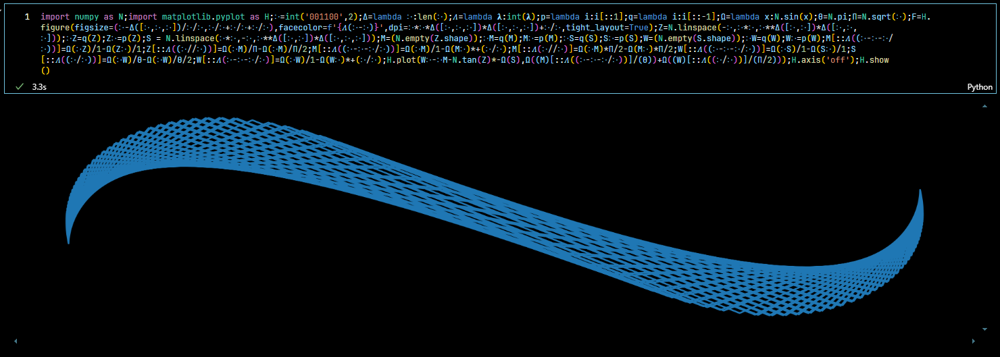

<p align="center">
  
</p>

```python
import numpy as N;import matplotlib.pyplot as H;𑀇=int('001100',2);Δ=lambda 𑀇:len(𑀇);𝛬=lambda 𝛌:int(𝛌);p=lambda i:i[::1];q=lambda i:i[::-1];Ω=lambda x:N.sin(x);Θ=N.pi;Π=N.sqrt(𑀇);F=H.figure(figsize=(𑀇-Δ([𑀇,𑀇,𑀇])/𑀇/𑀇,𑀇/𑀇+𑀇/𑀇+𑀇/𑀇),facecolor=f'{𝛬(𑀇-𑀇)}',dpi=𑀇*𑀇*Δ([𑀇,𑀇,𑀇])*Δ([𑀇,𑀇,𑀇])+𑀇/𑀇,tight_layout=True);Z=N.linspace(-𑀇,𑀇*𑀇,𑀇**Δ([𑀇,𑀇])*Δ([𑀇,𑀇,𑀇]));𑀇Z=q(Z);Z𑀇=p(Z);S = N.linspace(𑀇*𑀇,-𑀇,𑀇**Δ([𑀇,𑀇])*Δ([𑀇,𑀇,𑀇]));M=(N.empty(Z.shape));𑀇M=q(M);M𑀇=p(M);𑀇S=q(S);S𑀇=p(S);W=(N.empty(S.shape));𑀇W=q(W);W𑀇=p(W);M[::𝛬((𑀇-𑀇-𑀇/𑀇))]=Ω(𑀇Z)/1-Ω(Z𑀇)/1;Z[::𝛬((𑀇//𑀇))]=Ω(𑀇M)/Π-Ω(𑀇M)/Π/2;M[::𝛬((𑀇-𑀇-𑀇/𑀇))]=Ω(𑀇M)/1-Ω(M𑀇)*+(𑀇/𑀇);M[::𝛬(𑀇//𑀇)]=Ω(𑀇M)*Π/2-Ω(M𑀇)*Π/2;W[::𝛬((𑀇-𑀇-𑀇/𑀇))]=Ω(𑀇S)/1-Ω(S𑀇)/1;S[::𝛬((𑀇/𑀇))]=Ω(𑀇W)/Θ-Ω(𑀇W)/Θ/2;W[::𝛬(𑀇-𑀇-𑀇/𑀇)]=Ω(𑀇W)/1-Ω(W𑀇)*+(𑀇/𑀇);H.plot(W𑀇-𑀇M-N.tan(Z)*-Ω(S),Ω((M)[::𝛬((𑀇-𑀇-𑀇/𑀇))]/(Θ))+Ω((W)[::𝛬((𑀇/𑀇))]/(Π/2)));H.axis('off');H.show()
```

[Time Code](https://futurama.fandom.com/wiki/Time_Code)

The Time Code is a sequence of binary numbers which initiates a paradox-correcting timesphere. It is also a Level 87 code. This timesphere allows for one-way travel backwards through time, while simultaneously correcting any paradoxes that might ensue (usually with fatal results). The time code appeared in the Futurama movie Bender's Big Score and "Decision 3012", as a Xeroxed copy.

The time code itself was located on Philip J. Fry I's backside. The time code itself is as follows:

001100
010010
011110
100001
101101
110011
